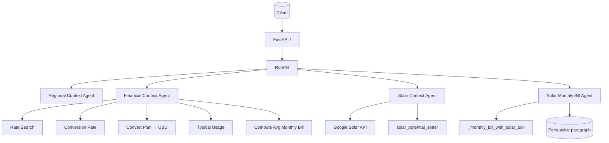

# Solar Calculation – Multi-Agent Architecture

## Overview

This service orchestrates several small, focused agents to fetch solar insights, gather local electricity cost context, and compute the post-solar monthly bill for a given location. It exposes a FastAPI endpoint that runs the full pipeline per request with an isolated session.

- Entry point: `main.py` (FastAPI) → builds and runs the agent graph per request
- Agent graph: `agents/agent.py`
- Key sub-agents:
  - Regional context discovery
  - Financial context (rates + typical usage → average monthly bill in USD)
  - Solar context (Google Solar API → buildingInsights → minimal solarPotential)
  - Solar calculator (post-solar monthly bill and a persuasive summary paragraph)

## High-level flow

root_agent (SequentialAgent)

- regional_context_agent (SequentialAgent)
  - regional_context_search_agent (Agent; tools: google_search, google_maps_grounding)
  - currency_code_setter (Agent)
- search_data_agent (ParallelAgent)
  - energy_billing_agent (Custom BaseAgent; runs two sequences in parallel)
    - get_usd_converted_rates (SequentialAgent)
      - electricity_rate_agent (Agent; tools: google_search)
      - conversion_rate_agent (Agent)
      - usd_converted_electricity_rates_agent (Agent; tools: convert_plan_to_usd)
      - usd_electricity_rates_setter (Agent)
    - set_typical_energy_usage (SequentialAgent)
      - typical_energy_usage_agent (Agent; tools: google_search)
      - energy_setter (Agent)
  - solar_context_agent (Custom BaseAgent)
    - First attempt: fetch_solar_insights_agent_1 (Agent; tool: fetch via lat/lon)
    - If no solarPotential present, enter loop:
      - solar_finalization_loop (LoopAgent; max_iterations=4)
        - solar_initial_sequence (SequentialAgent)
          - solar_coverage_similarity_agent (Agent)
          - proxy_coordinate_setter_agent (Agent; tool: apply proxy lat/lon)
        - fetch_solar_insights_agent_2 (Agent; tool: fetch and escalate when solarPotential appears)
- solar_potential_setter (Agent) — extracts a minimal solarPotential subset
- solar_monthly_bill_agent (Agent; tool: monthly bill calculator) — returns persuasive one-paragraph summary

### Loop semantics (solar coverage)

- Start with the provided latitude/longitude in session and fetch Google Solar API building insights.
- If the raw JSON includes solarPotential, exit the loop immediately.
- Otherwise, find a climatologically similar or nearby proxy location, apply its lat/lon, and retry.
- The loop escalates/terminates as soon as solarPotential appears in the response, or after 4 iterations.
- Raw buildingInsights JSON is preserved as-is under the session state; if a proxy was used, a small fallback flag is added without renaming or altering solarPotential fields.

### Session state keys (selected)

- Input/geo: `latitude`, `longitude`
- Regional: `regional_identifiers`, `currency_code`
- Financial: `usd_electricity_rates`, `energy_kWh`, `average_monthly_expense_usd`
- Solar (raw): `solar_building_insights` (verbatim API JSON)
- Solar (minimal): `solar_potentials` (fields: maxArrayPanelsCount, maxSunshineHoursPerYear, panelCapacityWatts, solarPanelConfigs[{panelsCount, yearlyEnergyDcKwh}])
- Calculation results: `solar_monthly_bill_analysis`

### Calculation details (minimal methodology)

- Derives price_per_kWh from the average monthly bill and typical monthly usage.
- For each solarPanelConfig, converts yearly DC kWh to AC (derate=0.85), subtracts from annual consumption, and recomputes the bill.
- If no configs exist, synthesizes one configuration using maxArrayPanelsCount × panelCapacityWatts (or 400 W default) × maxSunshineHoursPerYear, scaled by a performance ratio.
- The agent then produces a short, persuasive benefits paragraph based on the computed baseline/post-solar bill and savings.

1. HTTP request hits `/` (POST or GET). `main.py` initializes a fresh session and seeds `latitude`, `longitude`, and `address`.
2. The root agent graph runs:
   - Regional context agent (for locale/building hints).
   - Financial context agent (parallel sub-graph):
     - Finds a relevant local electricity plan (search).
     - Fetches currency conversion and converts plan → USD.
     - Finds typical monthly energy usage and normalizes to `{energy_kWh: float}`.
     - Computes `average_monthly_expense_usd` via `helper.total_monthly_cost`.
   - Solar context agent:
     - Calls Google Solar API `buildingInsights:findClosest` with lat/lon.
     - Setter extracts minimal `solarPotential` subset into `solar_potentials`.
   - Solar monthly bill agent:
     - Tool computes post-solar bill using `solar_potentials`, `average_monthly_expense_usd`, and `energy_kWh`.
     - Agent returns a plain-text persuasive paragraph based on the computed analysis.
3. `main.py` streams events; on final response it returns `{ message: "OK", response: <paragraph> }`.

## Agents and tools

### Financial context (`agents/subagents/financial_context`)

- electricity_rate_agent (search)
- conversion_rate_agent (search)
- usd_converted_electricity_rates_agent
  - Tools: `convert_plan_to_usd`, alias `get_currency_conversion`
- typical_energy_usage_agent (search)
- EnergyBillingAgent (orchestrator)
  - After running, session keys:
    - `usd_electricity_rates` (USD-normalized rate plan)
    - `energy_kWh` (normalized to `{energy_kWh: float}`)
    - `average_monthly_expense_usd` (computed)

### Solar context (`agents/subagents/solar_context`)

- Fetches Google Solar API `buildingInsights` for given lat/lon.
- Stores raw response in `solar_building_insights`.
- solar_potential_setter (LLM):
  - Instruction: extract ONLY minimal fields into `solar_potentials`:
    - `maxArrayPanelsCount`
    - `maxSunshineHoursPerYear`
    - `panelCapacityWatts` (if present)
    - `solarPanelConfigs` (each: `panelsCount`, `yearlyEnergyDcKwh`)
  - Output schema: `models.schemas.SolarPotentialRaw` (minimal)

### Solar calculator (`agents/subagents/solar_calculator`)

- Tool function `_monthly_bill_with_solar_tool(solar_potential, average_monthly_expense_usd, energy_kWh, tool_context)`
  - Coerces `energy_kWh` to a float if needed.
  - Calls `calculate_monthly_bill_with_solar` in `calculator.py` and stores result in `session.state["solar_monthly_bill_analysis"]`.
- Agent returns a single persuasive paragraph (not JSON) summarizing savings and benefits.

### Calculator logic (`agents/subagents/solar_calculator/calculator.py`)

- Inputs:
  - `solar_potential` (minimal subset)
  - `monthly_bill_usd`, `monthly_kwh_energy_consumption`
- Steps:
  - `price_per_kWh = monthly_bill_usd / monthly_kwh_energy_consumption`
  - Annual consumption = `monthly_kwh * 12`
  - For each config:
    - `initialAcKwhPerYear = yearlyEnergyDcKwh * 0.85` (DC→AC derate)
    - Remaining annual kWh = `max(0, annual - initialAc)`
    - Annual bill after solar = `remaining * price_per_kWh`
    - Monthly bill after solar = `annual_after / 12`
  - If no configs, synthesize one from `maxArrayPanelsCount`, `maxSunshineHoursPerYear`, and optional `panelCapacityWatts` (fallback 400 W) with a conservative performance ratio.
  - Returns `per_config` and a `recommended` config (min monthly bill).

## Session state (key variables)

- Input seeds: `latitude`, `longitude`, `address`
- Solar:
  - `solar_building_insights` (raw JSON)
  - `solar_potentials` (minimal subset for calculator)
  - `solar_monthly_bill_analysis` (computed JSON stored by tool)
- Financial:
  - `usd_electricity_rates` (USD-normalized plan JSON)
  - `energy_kWh` ({ energy_kWh: float })
  - `average_monthly_expense_usd` (float)

## API and configuration

- Endpoint: `POST/GET /` → `main.py`
- Environment:
  - Google Solar API: USE A GOOGLE CLOUD API KEY (Google Maps Platform / Solar API). Keys from Google AI Studio (Gemini) will NOT work for Solar API.
    - Create in Google Cloud Console:
      1. Create/choose a project, enable billing
      2. Enable "Solar API" (Maps Platform)
      3. Create an API key, restrict to HTTP referrers or IPs as needed
  - Set the key in your env/.env and ensure your client passes `key=<API_KEY>`.

## Diagrams

## Notes & troubleshooting

- If the Solar API returns no `solarPanelConfigs`, the calculator synthesizes a single config from summary fields.
- Ensure `energy_kWh` is normalized to `{energy_kWh: <float>}` before calculator runs.
- For API keys: do not embed keys in source. Use `.env` and restrict the key in Cloud Console.
